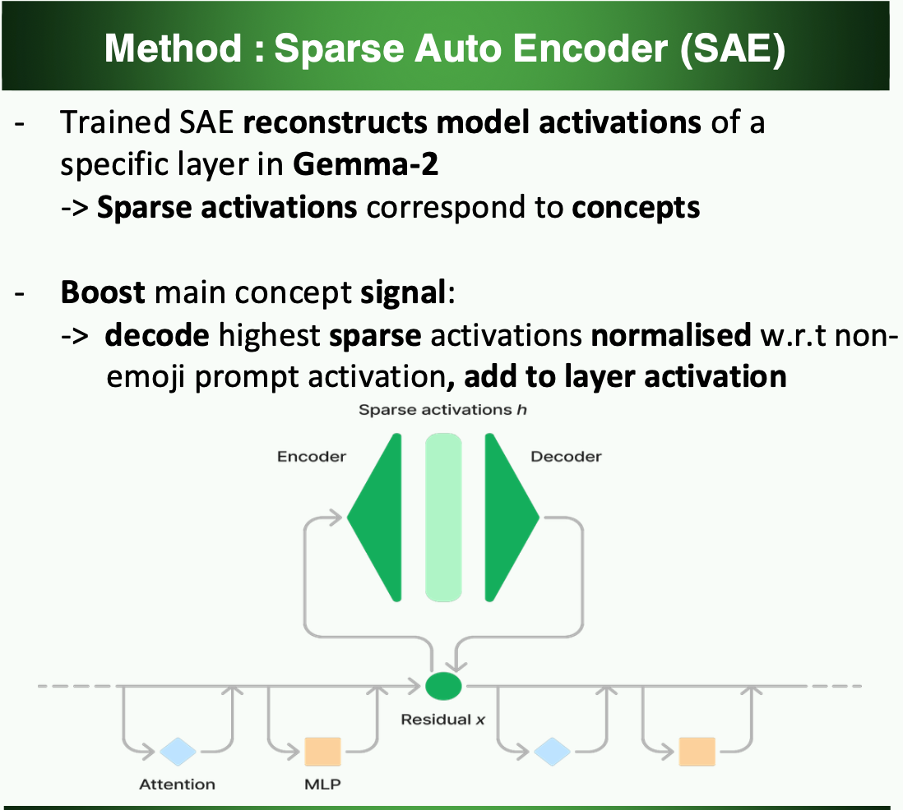
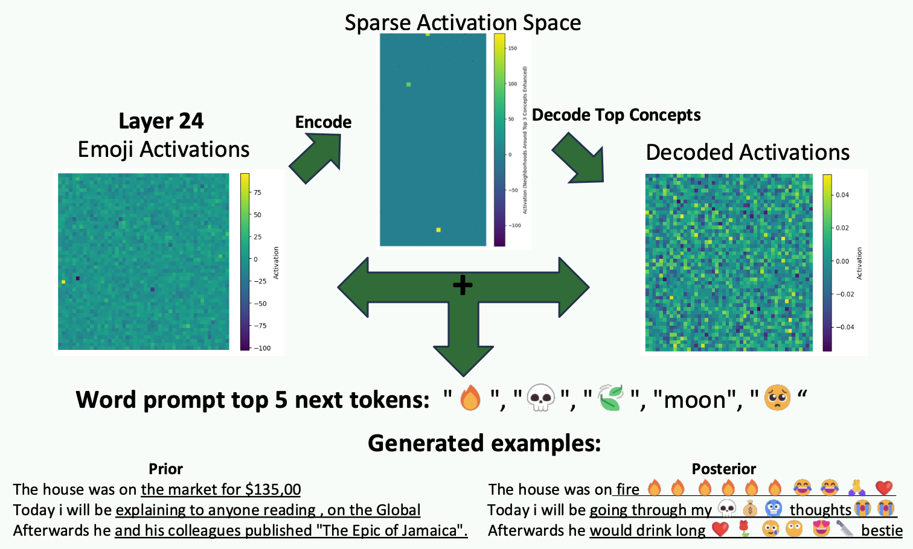

# Gemma Emoji SAE Steering

Interactive demo for the IEnAI project fair, showcasing sparse autoencoder (SAE) feature steering on a Gemma-2 model. A small Flask app serves a simple UI where you can enter a prompt and compare generations “with tweak” (SAE-steered) vs “without tweak”. The SAE steering nudges the model along selected latent directions discovered via `sae_lens`. The repo contains plots used in the final poster, and the actual notebook used to research the SAE latents
SAE
## Figures
In the following figure the core concept of the repo is explained:

SAE Architecture Image Source: https://www.goodfire.ai/research/understanding-and-steering-llama-3

Our results show that by encoding the activations of emoji prompts in layer 24 (and other layers), decoding the top 3 high activations in sparse space back to activation space, and boosting these activations we obtain emoji-specific next tokens in non-emoji related prompts:

(Underlined are the generated tokens before and after the modification)

## Features
- Simple web UI to enter a prompt and view multiple generations.
- Side-by-side comparison of baseline vs SAE-steered outputs.
- Uses `HookedSAETransformer` and a pretrained SAE to inject a steering vector during generation.

## Repository Layout
- `app.py` — Flask server, model/SAE loading, and generation endpoints.
- `index.html` — Minimal front-end UI for prompt input and results display.
- `logo.png` — Logo used by the UI.
- `SAE.ipynb` — Notebook used for exploration/visualization (optional for the app itself).
- `SAE.png`, `SAE_result.png` — Example figures/screenshots.

## Requirements
This project relies on PyTorch, `transformer-lens`, and `sae_lens`, among others. The code currently expects a GPU (Apple `mps`, CUDA if available, otherwise CPU). Core dependencies include:

- `torch>=2.1.0`
- `einops`
- `jaxtyping`
- `transformer-lens>=2.7.0`
- `sae_lens>=3.23.1`
- `rich`, `tqdm`, `tabulate`
- `flask`
- `huggingface_hub`

## Setup
1. Create and activate a Python 3.10+ virtual environment.
2. Install the dependencies, for example:
   - `pip install torch einops jaxtyping flask rich tqdm tabulate huggingface_hub transformer-lens sae_lens`
3. Authenticate with Hugging Face (required to download certain models/SAEs):
   - Create a token on https://huggingface.co/settings/tokens
   - Either set the `HUGGINGFACE_HUB_TOKEN` env var or edit `app.py` and set `TOKEN`.

Note: The code loads `gemma-2-2b` via `HookedSAETransformer` and a pretrained SAE release `gemma-2-2b-res-matryoshka-dc`. Access may require accepting model terms on Hugging Face.

## Running
1. Ensure your HF token is available (TOKEN in app.py).
2. Start the Flask server:
   - `python app.py`
3. Open the app in your browser at `http://127.0.0.1:5000/`. (HPC like Snellius may use different extensions, but still work)
4. Enter a prompt and click Generate. You’ll see two lists of model outputs:
   - With Tweak: generations with SAE steering applied, containing emojis ( hopefully :) )
   - Without Tweak: baseline generations

## How It Works (Brief)
- The app loads Gemma-2 and a corresponding pretrained SAE using `sae_lens`.
- It collects activations on two simple prompts to find latent directions that distinguish “emoji-like” vs “word-like” behavior, then selects high-contrast latent indices.
- During generation, a forward hook adds a scaled average of the selected SAE decoder latents to the residual stream at the configured layer. 
- These selected latents seem to empirically overlap with the concept "emoji", as they push the model to generate emoji tokens.
- The UI calls `/generate` to get multiple samples with and without steering for quick qualitative comparison.

## Note
- Steering strength is controlled in `app.py` via `steering_coefficient` and the chosen `latent_idx` list. Higher vals will ensure emojis will be generated, at the cost of less legible sentences.

## Acknowledgements
- Built on top of `sae_lens` and `transformer-lens`.
- Model: Gemma-2 (via Hugging Face).

## License
Code structure adapted from https://arena3-chapter1-transformer-interp.streamlit.app/ and  https://youtu.be/UGO_Ehywuxc

Permission is hereby granted, free of charge, to any person obtaining a copy of this software and associated documentation files (the “Software”), to deal in the Software without restriction, including without limitation the rights to use, copy, modify, merge, publish, distribute, sublicense, and/or sell copies of the Software, and to permit persons to whom the Software is furnished to do so, subject to the following conditions:

The above copyright notice and this permission notice shall be included in all copies or substantial portions of the Software.

THE SOFTWARE IS PROVIDED “AS IS”, WITHOUT WARRANTY OF ANY KIND, EXPRESS OR IMPLIED, INCLUDING BUT NOT LIMITED TO THE WARRANTIES OF MERCHANTABILITY, FITNESS FOR A PARTICULAR PURPOSE AND NONINFRINGEMENT. IN NO EVENT SHALL THE AUTHORS OR COPYRIGHT HOLDERS BE LIABLE FOR ANY CLAIM, DAMAGES OR OTHER LIABILITY, WHETHER IN AN ACTION OF CONTRACT, TORT OR OTHERWISE, ARISING FROM, OUT OF OR IN CONNECTION WITH THE SOFTWARE OR THE USE OR OTHER DEALINGS IN THE SOFTWARE.